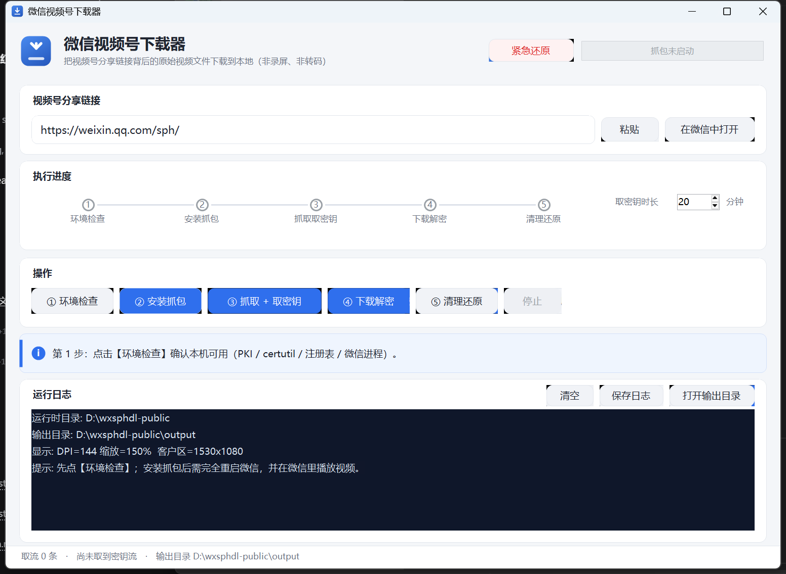

# wx-sph-dl —— 微信视频号视频下载（CLI + 免安装桌面版）

把 `https://weixin.qq.com/sph/xxxx` 这类视频号分享链接背后的**原始视频文件**下载下来（不是录屏、不是转码）。

> **仅供学习与个人备份使用。** 请只下载你有权保存的内容，遵守微信服务条款与著作权法；本项目与腾讯无任何关联。详见文末「合法使用」。



- 免安装单文件 exe（内嵌 Node，目标机不需要 Node/npm/openssl）
- 只代理腾讯系域名，**不动你原有的代理设置**（写入前先备份、退出时按备份还原）
- 端到端实测跑通：1920×1080 HEVC + AAC 原始文件，非录屏非转码
- 自研 MITM（不依赖 mitmproxy）+ 6 组回归测试（证书链、代理还原、进程归属、安全闸门、语法、构建自检）

> 这是我在 DSH 里做出来的工具，配套的 [DSH 技能说明](docs/dsh-skill/SKILL.md)（含完整排错记录）也在仓库里。

## 为什么需要这么绕

1. 分享短链会跳到 `channels.weixin.qq.com/finder-preview/pages/sph`，预览页在**非微信环境只给二维码**；它的接口 `get_feed_info` 只返回文案和封面，**不含视频地址**。
2. 真正的取流地址只能由**已登录的微信 PC 客户端**拿到，且只在客户端内部产生。
3. 该 CDN（`finder.video.qq.com/251/20302/stodownload`）**只加密文件前 128KB**（响应头 `x-encflag:1`、`x-enclen:131072`），其余是明文标准 MP4。
   密钥流 = `ISAAC-64(decodeKey)` 生成的 128KB，按 `buf[i] ^= keystream[i]` 异或。
4. `decodeKey` 不下发到可抓的 HTTP 里，但它对应的**密钥流本身只在播放期间驻留客户端进程内存** —— 所以本工具用「密文 + 已知明文 `ftyp`」反推特征，直接从内存里把那段 128KB 捞出来。

## 两种形态

| 形态 | 产物 | 目标机需要 |
|---|---|---|
| **免安装桌面版**（推荐给用户） | `dist\wx-sph-dl.exe`（约 83MB，单文件） | 只要 Windows 10/11（PowerShell 5.1、certutil 系统自带）——**不需要** Node/npm/openssl |
| 便携目录版 | `dist\wx-sph-dl-portable\`（exe + `runtime\node.exe` + `scripts\`） | 同上（绿色模式：全部读写都在该目录内） |
| CLI 源码版 | `sph.mjs` 等 | Node.js 18+ |

构建（离线，用系统自带 `csc.exe` 编译）：

```powershell
powershell -ExecutionPolicy Bypass -File build\build.ps1              # 单文件 exe（内嵌 node.exe）
powershell -ExecutionPolicy Bypass -File build\build.ps1 -Portable    # 便携目录
```

构建结束前会跑一次 `exe --selftest`，只有**退出码为 0 且日志里出现 `EXE-SELFTEST-OK`** 才输出 `BUILD-OK`（`-SkipSelftest` 可跳过，不推荐：它是唯一能证明「打出来的 exe 真能跑」的环节）。

单文件版首次运行会把内嵌 runtime 解包到 `%LOCALAPPDATA%\wx-sph-dl\{runtime,scripts,state,logs,output}`；若 exe 同目录已存在 `runtime\node.exe`（便携版），则**直接使用该目录，不写 AppData**（唯一例外见下）。

> **唯一的 AppData 例外：`%LOCALAPPDATA%\wx-sph-dl\records\`。** 这里放的是「本工具装过什么」的归属记录（PAC 端点、代理进程 pid+脚本路径+启动时间）。它必须放在 state 目录**之外**并且是机器级共享的，否则在「state 被删/中断」或「GUI 与 CLI 用了不同 `--state`」时就无法证明某个进程/设置是自己装的 —— 那正是会导致误杀、误删或者删不掉自己残留的场景。记录只有两三个 JSON 文件，不含任何用户数据；测试可用 `WXSPH_RECORDS` 重定向。

## 依赖（源码运行）

- Node.js 18+
- Windows PowerShell 5.1（系统自带）：证书由 **Windows PKI（`New-SelfSignedCertificate -Signer`）** 签发，**不需要 openssl**
- 可选 `ffprobe`（校验产物）
- 微信 PC 客户端已登录

## 用法（CLI）

```bash
cd tools/wx-sph-dl

node sph.mjs doctor            # 只读自检：平台/PKI/certutil/注册表/备份/端口/微信进程
node sph.mjs setup --dry-run   # 先校验：打印将生成的 PAC 与代理备份，不改系统设置
#   → 必须确认「其余 → <你原来的代理>」正确（若显示 DIRECT 而你本来有代理，先别继续）
node sph.mjs setup             # 写 PAC、起本地 MITM、装临时 CA、系统代理指向 PAC
#   → 然后【完全退出微信并重新打开】，在微信里打开视频号链接并持续播放 30 秒以上
node sph.mjs watch             # 从抓到的取流地址里下载密文头（内存搜索的特征）
node sph.mjs key               # 边播放边扫描内存，取回 128KB 密钥流（保持播放 30s+）
node sph.mjs decrypt           # 下载完整视频并解密 → output/xxx.mp4
node sph.mjs cleanup           # 停代理/扫描器、还原系统代理、移除临时 CA（需人工点确认）
node sph.mjs stopscans         # 只停后台扫描器
```

只读查看进度：`node sph.mjs status`

桌面版窗口把这 5 步做成按钮（①环境检查 ②安装抓包 ③抓取+取密钥 ④下载解密 ⑤清理还原），另有常驻的**「紧急还原」**（恢复代理 + 删证书）。

## 设计要点 / 安全边界

- **安全闸门（重要）**：`setup` 在**改动任何网络设置之前**，必须存在一份「本次写入且 schema 合法」的代理备份（`state/original-proxy.json`，无 BOM，四个字段类型正确）。
  备份缺失/损坏/空对象（`{}`）/`saveproxy` 失败 → **一律中止且不动网络**。`dry-run` 若尚无备份，会**只读读取当前真实设置**并如实显示，不臆测。
- **PAC 只把腾讯系域名**（`*.qq.com / weixin.com / qpic.cn / gtimg.cn / wxs.qq.com / …`）指向本地代理，其余流量仍走你原来的代理（`setup` 备份，`cleanup` 还原）。
- **还原是「照备份写回」，不是「一律删掉 PAC」**：`cleanup` 会把备份里的 `ProxyEnable/ProxyServer/ProxyOverride/AutoConfigURL` 四个字段原样写回；`AutoConfigURL` 只在**备份里本来就是空**时才删键（你自己有 PAC 的话会被原样保留）。`saveproxy` 若发现当前 `AutoConfigURL` 是**本工具自己的**端点（`127.0.0.1:<port>/proxy.pac`），会记成空值并警告 —— 否则一旦 state 目录丢失，我们自己写的 PAC 就会被当成"用户原值"永久还原。
- **备份丢失时不会留下死 PAC**：若 `original-proxy.json` 不存在（state 被删/中断），`cleanup` 会走 `dropownpac`，**只**删除匹配本工具签名的 `AutoConfigURL`，其它值一律不动并如实报告；`doctor` 也会把「系统里还挂着本工具的 PAC」判为失败。
- **孤儿代理进程**：`cleanup` 先按 pid 文件停；若端口仍被占用，则查**该端口的属主 PID**，然后要求三重证据齐全才终止 —— ①机器级运行记录里有「该 pid + 该端口」的条目（由 `proxy.mjs` 启动时写入 `%LOCALAPPDATA%\wx-sph-dl\records\`，**不在 state 目录里**，所以 state 被删也仍在）；②记录里的脚本绝对路径属于本工具的已知安装位置，且实际命令行引用的就是它；③进程启动时间与记录一致（排除 pid 被系统回收）。任一不满足即输出 `ORPHAN-REFUSED` 并放行，**绝不按进程名杀**。
- **证书**：CA 与各域名的叶子证书由 Windows PKI 生成并 **按指纹绑定**（`state/certs/index.json` 记录 thumbprint）；叶子只可能由本 state 拥有的 CA 签发。
  每个 state 目录的 CA 主体带**唯一后缀**（`CN=DSH Local MITM CA <8位十六进制>`，见 `state/certs/catag.txt`），因为多个**同名** CA 会让 Windows 建链时把错误的父证书塞进叶子 PFX，客户端随即报 `self-signed certificate in certificate chain`；叶子签发后还会**回读 PFX 校验链里恰好是「叶子 + 本 state 的 CA」**，不满足就拒绝使用。
  `cleanup` 会清掉 `Cert:\CurrentUser\My` 与中间 CA 存储里的临时 CA/叶子，并再跑一次前缀清扫兜住孤儿（自检也自清理）；`Cert:\CurrentUser\Root` 里的 CA 也会被删（走 .NET/CryptoAPI，实测无需弹窗；若被策略拦截会在输出里给出 certmgr.msc 手动步骤）。
  `doctor` 会报告三个存储的残留数量，**受信任根里有残留 CA 时直接判失败**。
- 进程**一律按 PID 文件管理**（`state/proxy.pid`、`state/scan.pids`），不做正则匹配进程名 —— 避免误杀无关进程（比如桌面版本体）。
- 失败/中断后重新 `setup` 幂等；`cleanup`/`purge-certs.ps1` 可随时执行。

## 目录

```
sph.mjs               # CLI 主入口（doctor/setup/status/watch/key/decrypt/cleanup/stopscans）
proxy.mjs             # 本地 MITM：Windows PKI 证书 + 取流地址记录 + PAC 服务
ps/win.ps1            # 注册表代理备份/还原/读取、CA(Root) 删除、内存密钥流扫描（纯 ASCII）
ps/certs.ps1          # CA/叶子证书签发与清理（Windows PKI，PFX 直接喂 Node tls）+ PFX 链校验
ps/purge-certs.ps1    # 维护：清掉本工具在 My / 中间 CA 存储里遗留的全部证书
gui/WxSphDl.cs        # WinForms 桌面窗口（csc 编译，无 designer 依赖）
build/build.ps1      # 构建单文件 exe / 便携目录（含可信的 EXE-SELFTEST 门禁）
build/sync-skill.ps1 # 把源码同步进 DSH 技能目录并逐文件校验 SHA-256
build/install-gh.ps1 + download-gh.mjs + gh-device-login.mjs # 装便携版 gh / 设备码登录（token 不打印）
build/publish.ps1    # 建公开仓库、推 main、建 Release 并上传 exe 与便携版 zip
tests/setup-gate-tests.mjs     # setup 安全闸门回归（T1–T10；含“中止时未改网络”断言）
tests/mitm-selftest.mjs        # 证书链自检（CONNECT+TLS+真实 GET 200 + 服务端实际链断言）
tests/cert-collision-tests.ps1 # 同名旧 CA / CA 已被清掉 两种证书陷阱的回归（8 断言）
tests/proxy-restore-tests.ps1  # 代理还原回归（自带 PAC 原样写回 / 空值删键 / 只认记录过的端点，21 断言）
tests/orphan-proxy-tests.ps1   # 进程归属：停自己的孤儿、拒绝异目录同名 proxy.mjs 与无记录者（16 断言）
tests/fixtures/foreign-proxy/proxy.mjs # 上一条用的“别的项目的同名脚本”夹具
tests/foreign-listener.mjs     # 无关监听者替身
tests/privacy-scan.ps1         # 发布前隐私扫描（本机路径/账号/内网 IP/活动签名值）
tests/parse-check.ps1          # 全部 .ps1 语法解析检查（不执行）
tests/remove-root-ca.ps1       # 清受信任根里的残留 CA（.NET/CryptoAPI）
tests/probe-certs.ps1          # 只读：枚举三个存储里的本工具证书与可用 .NET API
tests/diag-ca-overwrite.ps1    # 只读诊断：ca.crt 是否被真正覆盖（曾是故障根因）
state/                # 运行态：证书、PAC、capture.jsonl、videos.jsonl、heads/、keys/
output/               # 解密出的 mp4
dist/                 # 构建产物
```

测试怎么跑：

```powershell
node tests\setup-gate-tests.mjs                       # → GATE-TESTS-OK (失败 0 项)
node tests\mitm-selftest.mjs                          # → SELFTEST-OK（自清理临时证书）
powershell -File tests\cert-collision-tests.ps1       # → CERTS-REGRESSION-OK（8 断言）
powershell -File tests\proxy-restore-tests.ps1        # → PROXY-RESTORE-OK（21 断言，结束时把注册表还原回原样）
powershell -File tests\orphan-proxy-tests.ps1         # → ORPHAN-KILL-OK（16 断言）
powershell -File tests\privacy-scan.ps1               # → PRIVACY-SCAN-OK（发布前必跑）
powershell -File tests\parse-check.ps1                # → PS-PARSE-OK
```

## 排错

| 现象 | 原因 / 处理 |
|---|---|
| `status` 里抓到 0 条取流地址 | 微信没走代理：**完全退出并重开微信**；或还没在微信里播放视频 |
| `key` 超时未找到 | 扫描与播放没重叠 —— 保持播放 30 秒以上再跑；或密文头不是正在播的那个视频（重跑 `watch`） |
| `decrypt` 报下载 403/404 | 签名 URL 过期（通常几十分钟～几小时）—— 重新播放，再 `watch` → `key` → `decrypt` |
| `decrypt` 出来花屏/无法解析 | 密钥流与视频不匹配（多为 watch 到的是别的视频）—— 重跑 `watch`/`key` |
| TLS 报 `self-signed certificate in certificate chain` | 修复前有两个成因，现都已堵住：①证书存储里累积多个**同名** CA；②`certutil -encode` **不覆盖已存在的 ca.crt**，代理签了新 CA 而客户端仍信任旧 PEM。现在 CA 主体带唯一后缀、`ca.crt` 自己写并回读自校验、叶子 PFX 链逐张校验。仍遇到则跑 `ps\purge-certs.ps1` + `tests\remove-root-ca.ps1` 清干净后重试 |
| 换了新版 exe，行为却没变 | 修复前 `version.stamp` 只由常量拼成，导致**升级后仍跑首次解包的旧脚本**。现在 stamp 含内嵌脚本的 SHA-256，脚本一变就重新解包 |
| `build.ps1` 报 `exe --selftest failed` | 这是真失败（旧版对 `/target:winexe` 用 `& $exe --selftest` 会拿到假的退出码 0）。看它打印的自检日志：常见原因是 `doctor` 判定受信任根里还有残留 CA |
| `cleanup` 后 `AutoConfigURL` 还在、或 18080 仍在监听 | 说明上一轮实跑**没跑完 cleanup**（PID 文件与 state 一起丢了）。现在 `cleanup` 会自动兜底：只删**记录过的**自有 PAC 端点，并按「机器级运行记录 + 脚本绝对路径 + 启动时间」三重证据核实后停掉孤儿代理（无记录者一律拒绝）。手工等价命令：`ps\win.ps1 -Mode dropownpac`；核对注册表用 `ps\win.ps1 -Mode getproxy` |
| 担心「我们写的 PAC 被当成你的原值」 | 已防：`saveproxy` 遇到 `127.0.0.1:<port>/proxy.pac` 会记成空值并打印 `WARN normalized`；`tests\proxy-restore-tests.ps1` 覆盖该行为 |
| `setup` 报「代理备份无法解析/schema 不合法」并中止 | 这是**保护**而非故障。删除 `state/original-proxy.json` 后重跑 `setup` 重新备份即可 |
| 清理后上网异常 | `node sph.mjs cleanup` 会从 `state/original-proxy.json` 还原；必要时核对 `HKCU\...\Internet Settings` |
| 桌面版双击没反应 | 看 `%LOCALAPPDATA%\wx-sph-dl\logs\`（绿色版看 exe 同目录 `logs\`） |
| Defender 删掉了 exe | 改用 `build.ps1 -Portable` 的目录版（不释放 runtime 到 AppData） |

## 已验证

- 微信 PC 4.1.13.65（Windows 11）：端到端跑通，产出 1920×1080 HEVC + AAC 原始文件（33.17s / 5.32MB，ffprobe 正常，抽帧人工确认）。
- `setup` 安全闸门回归：**22 项断言全绿**，含 `{}`/类型错/截断/BOM/无备份/saveproxy 失败，且用「注册表前后快照一致」证明中止时未改网络。
- MITM 证书链自检：Windows PKI 签发 CA + 叶子 → CONNECT+TLS 握手 `authorized=true` → 服务端实际链正好两级（叶子 + 本 CA）→ 真实 `HTTP 200`。
- 证书陷阱回归 `cert-collision-tests.ps1`：**8/8 通过** —— 存储里放一个同名旧 CA 时，连续两轮自检都通过；state 里留着旧 pfx 但 CA 已被清掉时，会重新签发而不是复用（旧代码在这两种场景下都会失败）。
- 单文件 exe 与便携版：`--selftest` 均为 `EXE-SELFTEST-OK`，且 `build.ps1` 现在**同时校验退出码与 `EXE-SELFTEST-OK` 标记**（此前会误报成功）。
- 证书卫生：`doctor` 三存储残留 `My=0 CA=0 Root=0`；受信任根里的历史残留 CA 已用 `tests\remove-root-ca.ps1` 删除。
- 代理还原回归 `proxy-restore-tests.ps1`：**15/15 通过** —— 用户自带 PAC 原样写回、空值删键、四字段照备份还原、`dropownpac` 只删自己的、`saveproxy` 把自己的 PAC 归一化为空并告警、陌生 PAC 一字不改；结束时注册表与开跑前快照完全一致。
- 孤儿进程回归 `orphan-proxy-tests.ps1`：**8/8 通过** —— 无 pid 文件的代理被停掉且端口释放（`ORPHAN-STOPPED`），陌生程序占用同端口时**拒绝终止**（`ORPHAN-REFUSED`）。
- 实测修复：一次中断的实跑遗留下的 `AutoConfigURL=http://127.0.0.1:18080/proxy.pac`（以及被 `setpac` 改成 0 的 `ProxyEnable`）已按 `state/original-proxy.json` 还原为原值（示例：`ProxyEnable=1 / ProxyServer=127.0.0.1:1080 / 无 PAC`），端口上的孤儿代理也已停止。

## 已知未做

- 工具形式的**端到端实跑**（重新挂 MITM、改系统代理、由用户在微信里播放）尚未在本轮复验；上一轮的抓包/解密链路证据见 `state/` 与 `output/`。

## 合法使用

仅用于下载你有权保存的内容（自己的作品、已获授权的素材、合理使用场景）。请遵守微信服务条款与著作权法。

本工具会临时安装一个本地根证书以解密你自己设备上的流量，**用完请务必执行 `node sph.mjs cleanup`**（或点桌面版的「清理还原」）：它会停止代理与扫描进程、按备份还原系统代理、删除临时 CA。残留检查见「验证」一节。

本项目与腾讯公司无任何关联，未获其授权或认可；相关商标归各自所有者。

## 许可

[MIT](LICENSE)。作者不对使用本工具产生的任何后果负责；请自行确认你的使用场景合法。
